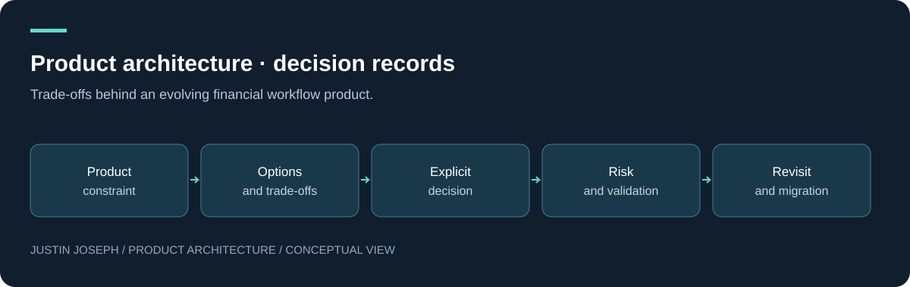

# Product architecture · decision records

Trade-offs behind an evolving financial workflow product.

**Justin Joseph · Product Manager — FinTech, Trading Platforms & Decision Systems**

[Read the detailed case study](docs/portfolio.md) · [Explore the flagship](https://github.com/justin5128/trade-platform-case-study)

## Product problem

Prototype speed creates useful learning, but growing responsibilities can blur ownership and make failures difficult to isolate.

## Objective and users

Make architectural choices explicit, reversible where possible and tied to product consequences.

**Users:** Product managers, engineering collaborators and platform operators.

## Constraints

Existing spreadsheet workflows, API dependencies, migration cost, reliability and limited operational capacity.

## Architecture and decisions

The records address presentation, data, orchestration and execution boundaries. The analytical subsystem remains opaque throughout.

Retain the useful prototype while introducing clearer boundaries incrementally. Distinguish observed design direction from proposals requiring validation.

## Evolution and evidence

Ten records written for this portfolio explain the current prototype context and proposed migration choices. They are not backdated records or evidence that every migration has shipped.

This documentation was written for the portfolio in September 2026. It describes product work and design reasoning; it does not claim independently verified adoption, returns or performance improvements.

## My role and learning

My contribution spans product requirements, workflow design, architecture decisions, hands-on diagnosis, AI-assisted development and iteration. AI-assisted implementation is part of the process; this is not a claim that I independently hand-coded every component.

An architecture decision should include a reason to revisit it, not only a preferred technology.

## Explore

- [Detailed documentation](docs/portfolio.md)
- [Portfolio profile](https://github.com/justin5128)
- [Disclosure boundary](SECURITY.md)

## Intentionally excluded

This repository is a sanitised product and architecture case study. Production source code, credentials, proprietary analytical methods, operational configurations and confidential business logic are intentionally excluded.

---

© Justin Joseph. Portfolio documentation. Production implementation and proprietary methods are not included.
